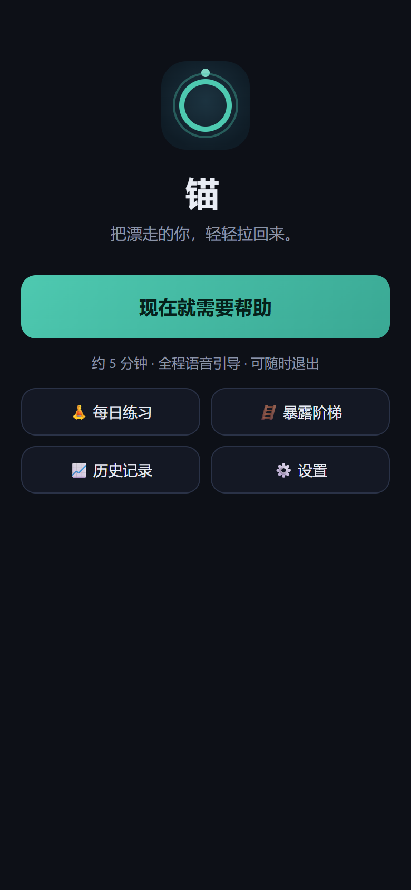
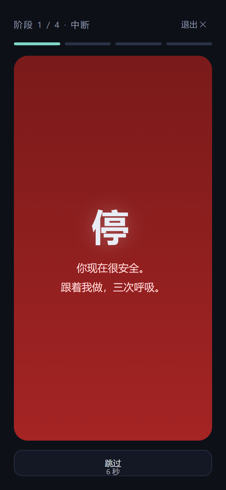
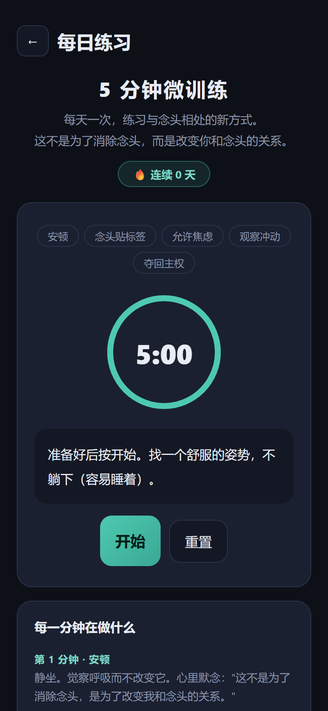
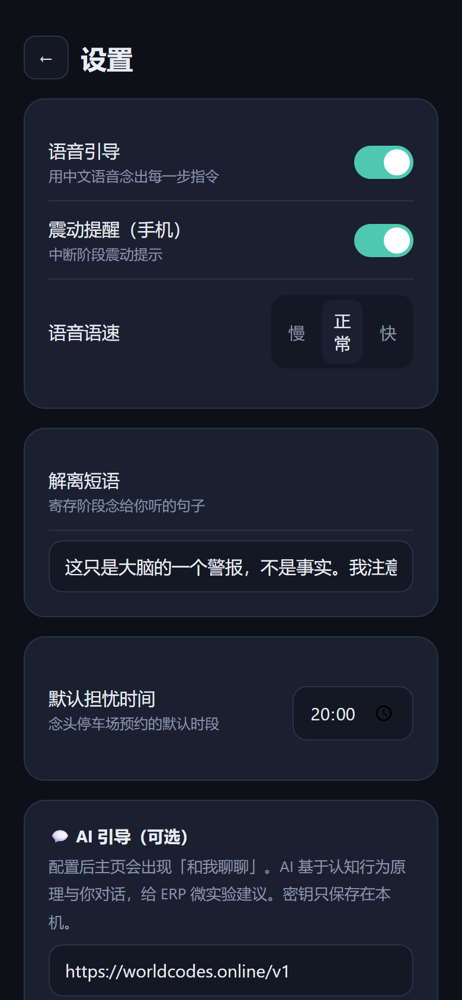

# 锚 · MindAnchor

> **把漂走的你，轻轻拉回来。**
> 思维强迫（强迫思维/穷思竭虑）发作时的应急引导工具：**打断回路 → 降下焦虑 → 把注意力拉回现实**。

**[English](README.en.md) · 中文**

  

一个 **100% 本地运行、完全离线、数据不出设备** 的开源 PWA。当思维强迫在压力下发作时，一键启动约 5 分钟的引导流程，用有临床依据的技术帮你"刹车"：打断回路 → 生理性呼吸降焦虑 → 感官着陆 → 把念头寄存到"停车场"。

> ⚠️ **重要声明**：本项目是自助应急工具，**不构成医疗建议，不替代专业心理治疗**。症状严重时请寻求专业帮助（全国心理援助热线 12356 / 北京 010-82951332）。

---

## ✨ 功能总览

### 📸 界面预览

| 主页 | 紧急协议 | 每日练习 | 设置 |
|---|---|---|---|
|  |  |  |  |

### 🆘 紧急协议（发作时，约 5 分钟，可随时退出）

| 阶段 | 时长 | 内容 | 依据 |
|---|---|---|---|
| 1. 中断 | 8 秒 | 全屏强提示 + 震动，打断强迫回路 | 注意转移/刺激中断 |
| 2. 呼吸 | 6 轮 | 生理性叹息呼吸（双吸+长呼） | 斯坦福生理叹息研究 |
| 3. 着陆 | ~2 分钟 | 5-4-3-2-1 感官着陆 | 接地技术（Grounding） |
| 4. 寄存 | 自由 | 念头停车场 + 预约担忧时间 + **冲动观察** | 担忧推迟 + ERP |

### 🧘 每日预防

- **5 分钟微训练**：安顿 → 念头贴标签 → 允许焦虑 → 观察冲动 → 夺回主权（ACT/ERP 技术，连续天数记录）
- **暴露阶梯**：L1→L5 自定义暴露任务，逐级挑战

### 📈 自我观察

- **SUDS 0-100 量表**：标准临床主观焦虑单位，四档标签
- **焦虑证据回访**：30 分钟后二次评分，实证"焦虑会自己下降"
- **7 天趋势图**：发作次数 + 平均 SUDS（纯 canvas，无外部依赖）

### 💬 AI 引导（可选）

- 接入任意 OpenAI 兼容接口（默认 [worldcodes.online](https://worldcodes.online)），CBT/ERP 原理的引导对话
- 按主题（检查/污染/侵入性念头/关系）给 ERP 微实验建议
- 内置危机检测：自伤相关表述触发求助信息展示

---

## 🌐 在线试用

**无需安装，浏览器直接打开：** <https://andesiwangzhiyi-alt.github.io/mindanchor/>

数据只存在你自己的浏览器里，用完即走。

---

## 🚀 快速开始

### 电脑
```bash
git clone https://github.com/<你的用户名>/mindanchor.git
cd mindanchor
python -m http.server 8123 --bind 127.0.0.1
# 浏览器打开 http://127.0.0.1:8123
```
Windows 下直接双击 `scripts/start.bat` 一键启动。

### 手机（同一 WiFi）
1. 电脑访问 `http://127.0.0.1:8123` 后，用 `ipconfig` 查电脑局域网 IP（如 192.168.1.100）
2. 手机浏览器访问 `http://192.168.1.100:8123`
3. 浏览器菜单 → **添加到主屏幕**，之后全屏打开、支持震动、**断网可用**（首次访问自动离线缓存）

### AI 对话配置（可选）
设置页 → AI 引导 → 填写：
- 接口地址（默认 `https://worldcodes.online/v1`）
- API Key
- 模型名（如 `claude-sonnet-4-6`）

密钥只保存在本机浏览器，不上传任何数据。

---

## 📁 项目结构

```
mindanchor/
├── app/                        # 应用本体（纯前端，无需构建）
│   ├── index.html              # 单文件应用：全部 UI + 逻辑（含详细注释）
│   ├── manifest.webmanifest    # PWA 清单（可安装到主屏幕）
│   ├── sw.js                   # Service Worker（离线缓存）
│   └── icons/                  # 应用图标（呼吸圆环设计）
├── scripts/                    # 开发工具
│   ├── start.bat               # Windows 一键启动
│   ├── make_icon.py            # 图标生成脚本（PIL）
│   └── test_v01.py             # Playwright 回归测试（34 项断言）
├── docs/                       # 文档
│   ├── 使用指南.md              # 详细使用说明
│   ├── 设计方案.md              # 设计原理与临床依据
│   ├── 调研报告-OCD数字干预.md   # 全网产品/研究调研
│   └── 开源项目源码分析.md       # 4 个相关开源项目分析
├── research/                   # 调研过程脚本与数据（可复现）
├── CHANGELOG.md                # 版本历史
├── LICENSE                     # MIT
└── README.md                   # 本文档
```

---

## 🔒 隐私与数据

- 所有数据（记录、练习、阶梯、聊天）只存浏览器 **localStorage**，无任何云端上传
- 完全离线可用，不依赖任何 CDN
- 可随时在设置/历史中清空

---

## 🧠 设计来源

本项目吸收了以下公开成果的设计思路（详见 [docs/开源项目源码分析.md](docs/开源项目源码分析.md)）：

- **krishna**（CBT/ERP 对话状态机、vignette 场景库结构）→ AI 引导
- **OCDetour**（延迟强迫计时）→ 念头停车场/担忧时间
- **ocd-practice**（5 分钟冥想脚本、SUDS 量表、暴露阶梯）→ 每日练习与量表
- **ERPMate**（焦虑时间曲线）→ 焦虑证据回访

临床技术参考：CBT（认知行为疗法）、ERP（暴露反应阻止）、ACT 认知解离、担忧推迟技术、生理性叹息呼吸。

---

## 📜 许可证

[MIT](LICENSE)。欢迎 fork、改造、提出建议。

**请记住**：工具是拐杖，不是治疗本身。如果强迫思维持续影响生活，请务必寻求专业的心理治疗。
